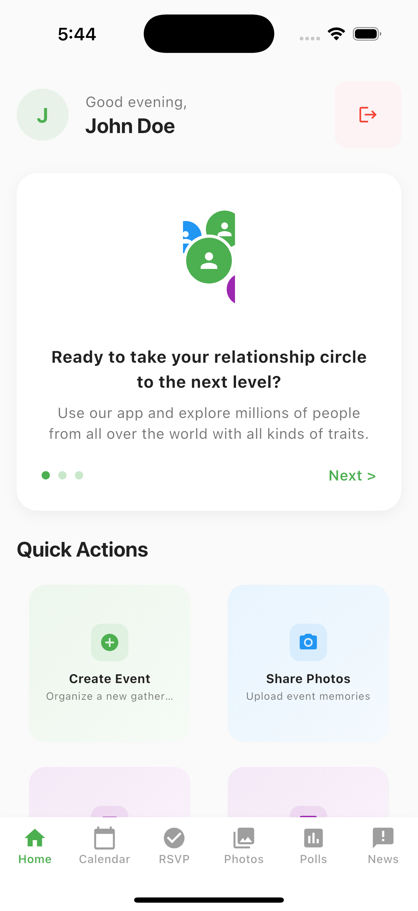
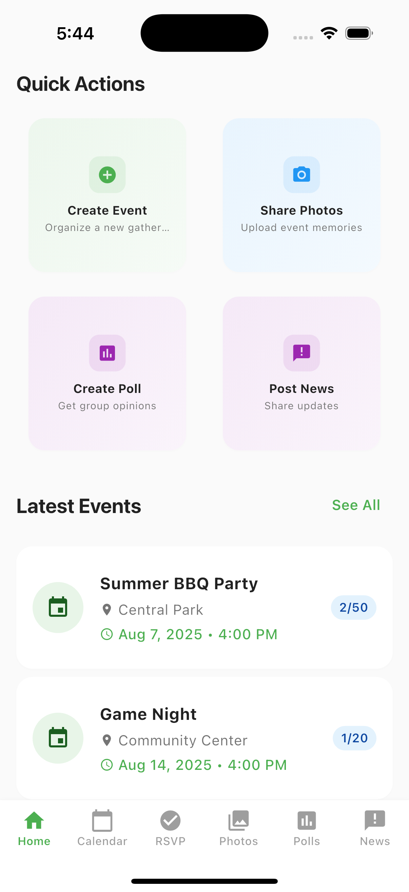
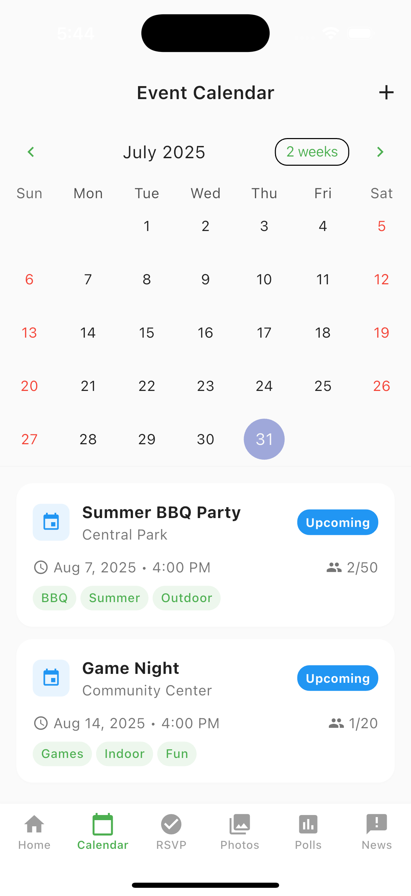
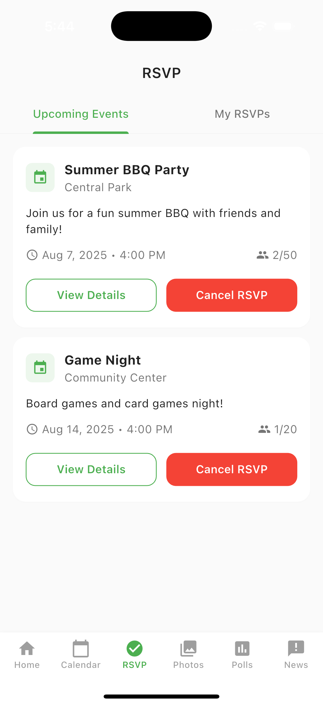
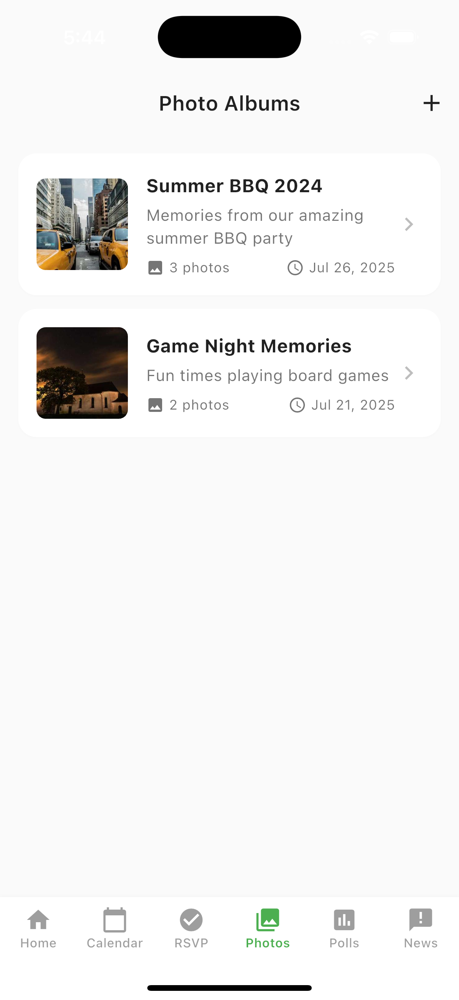
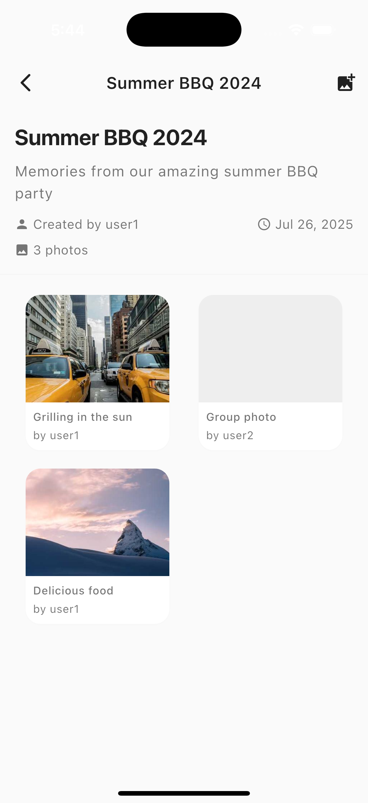
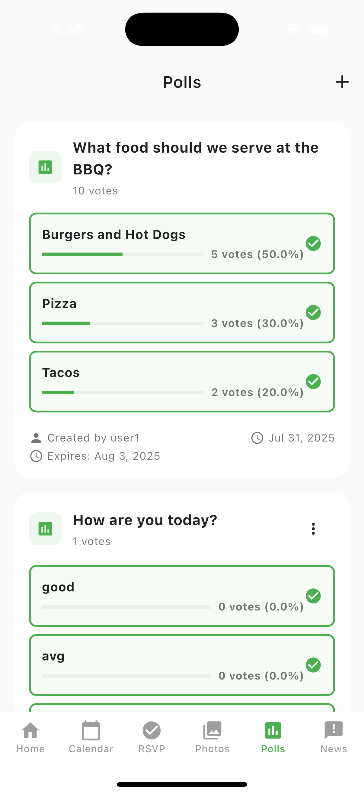
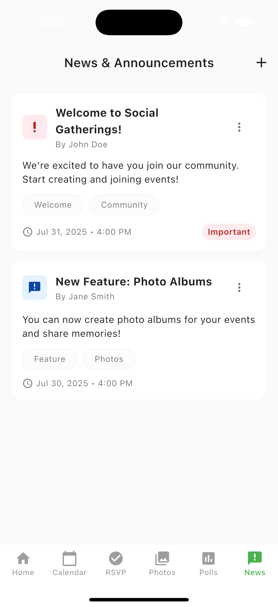
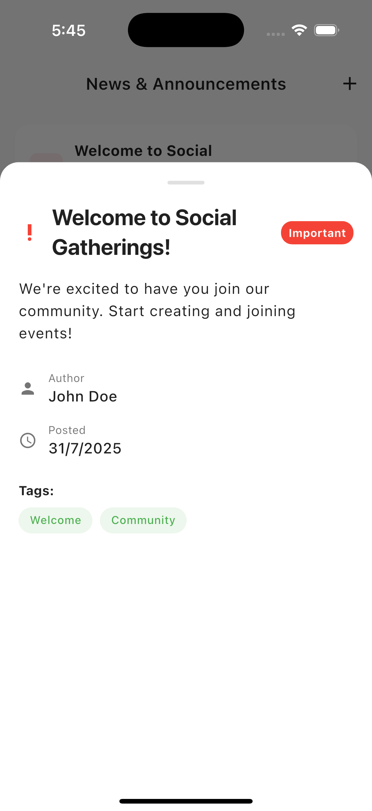

# Social Gatherings Flutter App

A complete Flutter-based mobile application for organizing private social gatherings with demo login functionality and local storage database.

## 🎯 Features

### Core Functionality
- **Demo Authentication System**
  - Login with predefined credentials
  - User registration
  - Session management with local storage
  - Profile management

- **Event Management**
  - Create and view events
  - Calendar view with event markers
  - RSVP functionality
  - Event details and status tracking

- **Photo Albums**
  - Create photo albums for events
  - Gallery view with dummy images
  - Photo details and captions

- **Polls System**
  - Create and participate in polls
  - Real-time voting with progress bars
  - Poll results visualization

- **News & Announcements**
  - View community updates
  - Important announcements highlighting
  - Tag-based categorization

### Technical Features
- **Local SQLite Database**
  - Complete data persistence
  - Offline functionality
  - Demo data pre-loaded

- **State Management**
  - Provider pattern implementation
  - Reactive UI updates
  - Efficient data flow

- **Modern UI/UX**
  - Material Design 3
  - Dark/Light theme support
  - Responsive layouts
  - Smooth animations

## 🛠 Tech Stack

- **Flutter** (Latest stable version)
- **Dart** (Latest stable version)
- **SQLite** (Local database)
- **Provider** (State management)
- **Shared Preferences** (Session storage)
- **Table Calendar** (Calendar widget)
- **Material Design** (UI components)

## 📱 Screenshots

### App Screenshots

<details>
<summary>📱 Click to view screenshots</summary>

#### Home Screen

*Main dashboard with relationship circle and quick actions*

#### Home Screen (Alternative View)

*Alternative view of the home screen with different content*

#### Calendar View

*Event calendar with upcoming gatherings and event markers*

#### RSVP System

*RSVP functionality for event attendance management*

#### Photos & Albums

*Photo albums and gallery view with event memories*

#### Photo Details

*Detailed view of individual photos with captions*

#### Polls

*Interactive polls with voting functionality and results*

#### News & Announcements

*Community updates and announcements feed*

#### News Details

*Detailed view of news articles and announcements*

</details>

### App Features Showcase

The screenshots above demonstrate the key features of the Social Gatherings app:

- **🏠 Home Dashboard**: Modern interface with relationship circle visualization
- **📅 Calendar Management**: Event scheduling and calendar view
- **✅ RSVP System**: Easy event attendance management
- **📸 Photo Albums**: Event photo sharing and gallery
- **🗳️ Polls**: Interactive voting and decision making
- **📢 News Feed**: Community updates and announcements

**Note**: All screenshots show the app running with demo data and the modern Material Design 3 interface. If images don't load immediately, please refresh the page or wait a moment for GitHub to process them.

### How to Add Your Own Screenshots

1. **Take screenshots** of your app running in a simulator/emulator
2. **Save them** in the `screenshots/` folder with descriptive names:
   - `login_screen.png`
   - `home_screen.png`
   - `calendar_screen.png`
   - `polls_screen.png`
   - `news_screen.png`
   - `profile_screen.png`

3. **Update the README** by replacing the placeholder text above with your actual screenshots

**Note**: Make sure your screenshots are clear, well-lit, and showcase the key features of your app!

## 🚀 Getting Started

### Prerequisites
- Flutter SDK (3.0.0 or higher)
- Dart SDK (3.0.0 or higher)
- Android Studio / VS Code
- Android Emulator or iOS Simulator

### Installation

1. **Clone the repository**
   ```bash
   git clone <repository-url>
   cd flutter-social-gatherings
   ```

2. **Install dependencies**
   ```bash
   flutter pub get
   ```

3. **Run the app**
   ```bash
   flutter run
   ```

## 👨‍💻 Developer & Contact Information

### **Ashok Chandrapal**
*Flutter Developer & Mobile App Specialist*

---

### 📞 **Get In Touch**

| Contact Method | Details |
|----------------|---------|
| 📧 **Email** | [developer7039@gmail.com](mailto:developer7039@gmail.com) |
| 📱 **Phone** | [+91 9033359874](tel:+919033359874) |
| 🐙 **GitHub** | [@developer-ashok](https://github.com/developer-ashok) |
| 💼 **LinkedIn** | [ashok-chandrapal](https://www.linkedin.com/in/ashok-chandrapal/) |

---

### 🚀 **What I Do**
- **Mobile App Development** (Flutter, React Native)
- **Cross-Platform Solutions**
- **UI/UX Design & Implementation**
- **Backend Integration**
- **App Maintenance & Support**

### 💬 **Let's Connect**
*Feel free to reach out for:*
- 🤝 **Collaboration opportunities**
- 💡 **Project discussions**
- 🐛 **Bug reports or feedback**
- 📱 **Custom app development**
- 🎯 **Technical consultations**

---

### 📱 **In-App Contact**
*This app includes a floating contact button that you can drag anywhere on the screen to easily get in touch!*

### Demo Credentials

The app comes with pre-configured demo accounts:

| Email | Password | Description |
|-------|----------|-------------|
| `john@example.com` | `password123` | Demo user 1 |
| `jane@example.com` | `password123` | Demo user 2 |
| `demo@example.com` | `demo123` | Demo user 3 |

## �� Project Structure

```
lib/
├── main.dart                 # App entry point
├── models/                   # Data models
│   ├── user.dart
│   ├── event.dart
│   ├── photo_album.dart
│   ├── poll.dart
│   └── announcement.dart
├── providers/                # State management
│   ├── auth_provider.dart
│   ├── event_provider.dart
│   ├── photo_provider.dart
│   ├── poll_provider.dart
│   └── announcement_provider.dart
├── services/                 # Business logic
│   ├── auth_service.dart
│   └── database_service.dart
├── screens/                  # UI screens
│   ├── splash_screen.dart
│   ├── auth/
│   │   ├── login_screen.dart
│   │   └── register_screen.dart
│   ├── main_screen.dart
│   ├── home_screen.dart
│   ├── calendar_screen.dart
│   ├── rsvp_screen.dart
│   ├── photos_screen.dart
│   ├── polls_screen.dart
│   ├── announcements_screen.dart
│   └── profile_screen.dart
├── widgets/                  # Reusable widgets
│   ├── quick_action_card.dart
│   ├── announcement_card.dart
│   └── photo_album_card.dart
└── utils/                    # Utilities
    └── theme.dart
```

## 🎨 Features Overview

### 1. Home Screen
- Welcome message with user greeting
- Quick action cards for common tasks
- Upcoming events preview
- Latest announcements

### 2. Event Calendar
- Monthly calendar view with event markers
- Tap to view event details
- RSVP functionality
- Event status tracking

### 3. RSVP System
- List of upcoming events
- Confirm/cancel attendance
- Attendee count display
- Event details modal

### 4. Photo Albums
- Grid layout of photo albums
- Gallery view with dummy images
- Photo details and captions
- Album creation (UI ready)

### 5. Polls
- View and vote in polls
- Real-time results with progress bars
- Poll expiration tracking
- Voting confirmation

### 6. News & Announcements
- Scrollable list of updates
- Important announcements highlighting
- Tag-based filtering
- Detailed view modal

### 7. Profile Management
- User profile editing
- Activity statistics
- Settings and preferences
- About information

## 🗄️ Database Schema

The app uses SQLite with the following tables:

- **users** - User accounts and profiles
- **events** - Event information and details
- **photo_albums** - Photo album metadata
- **photos** - Individual photo records
- **polls** - Poll questions and metadata
- **poll_options** - Poll voting options
- **announcements** - News and announcements

## 🔧 Configuration

### Dependencies
All required dependencies are listed in `pubspec.yaml`:

```yaml
dependencies:
  flutter:
    sdk: flutter
  cupertino_icons: ^1.0.2
  shared_preferences: ^2.2.2
  sqflite: ^2.3.0
  path: ^1.8.3
  provider: ^6.1.1
  intl: ^0.18.1
  table_calendar: ^3.0.9
  image_picker: ^1.0.4
  cached_network_image: ^3.3.0
  flutter_staggered_grid_view: ^0.7.0
```

## 🚧 Limitations & Future Enhancements

### Current Limitations
- No backend integration (local storage only)
- No real-time updates
- No image upload functionality
- No push notifications

### Planned Enhancements
- Backend API integration
- Real-time messaging
- Image upload and storage
- Push notifications
- Event sharing
- Advanced search and filtering
- User roles and permissions

## 🤝 Contributing

1. Fork the repository
2. Create a feature branch
3. Make your changes
4. Add tests if applicable
5. Submit a pull request

## 📄 License

This project is licensed under the MIT License - see the LICENSE file for details.

## 🆘 Support

For support and questions:
- Create an issue in the repository
- Check the documentation
- Review the demo credentials for testing

## 🎉 Acknowledgments

- Flutter team for the amazing framework
- Material Design team for the design system
- All contributors and testers

---

**Note**: This is a demo application with local storage. All data is stored locally and will be reset when the app is uninstalled. 